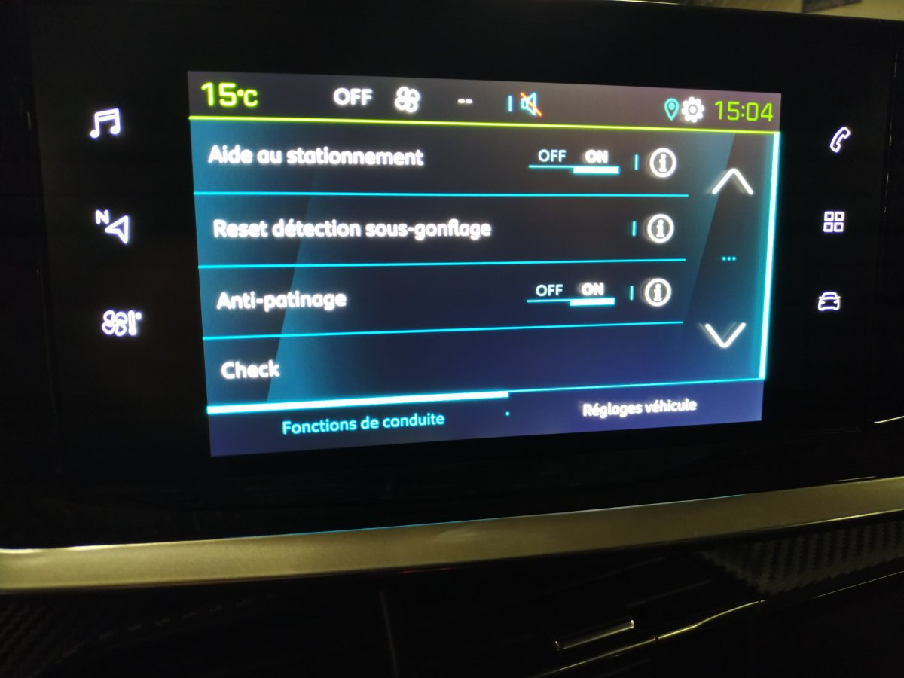

## Activity Header 
### Introducción

En esta práctica vamos a cambiar de tercio. En esta ocasión la mayor parte del esfuerzo la vamos a dedicar a analizar la interfaz de usuario de vehículos eléctricos o híbridos de distintas marcas.

<br>

Nuestro objetivo es determinar los componentes y las asociaciones de los mismos que dan lugar a las pantallas que utilizan los conductores para interactuar con los vehículos de nueva generación.

<br>

Por otro lado, diseñaremos un componente de los que hayamos detectado y lo implementaremos en una app sencilla desarrollada con React Native e intentaremos que se parezca lo máximo posible al original.

<br>

Esta práctica se desarrollará en parejas, por lo tanto, tendrán que consignarse en la tabla del comienzo del documento los dos miembros de cada grupo.

<br>

Si por algún motivo tuviera que generarse otro agrupamiento, este lo tendrá que autorizar el profesor.

<br>

Por último, esta práctica contará con dos entregables. Por un lado una app en la que se integre el componente seleccionado.
Por otro lado, un vídeo en el que se lleve a cabo el análisis de la interfaz gráfica de los vehículos reales. Dicho vídeo no puede superar los 5 minutos de duración.

<br>

Para ayudarles en la confección del vídeo, éste debería responder a las siguientes cuestiones:

<br>

Análisis de componentes basados en los principios de atomic design: Debe indicarse qué átomos, moléculas y sistemas se detectan en la interfaz. Para cada uno de esos elementos habría que determinar la siguiente información.

<br>

El nombre que le pondrías si tuvieras que convertirlo en un componente en tu código.
La representación gráfica del componente.(Puede ser una captura de pantalla insertada en el vídeo o una explicación clara en el propio vídeo de qué elementos visuales conforman dicho componente.)
La función que desempeña en la interfaz.

<br>

De todos los elementos que hayan localizado en el paso anterior, en el vídeo deberán seleccionar uno e implementarlo indicando cómo se ha desarrollado paso a paso. El elemento implementado no podrá ser un átomo y tendrá que mostrar cierta interactividad.

<br>

## How to use the app

you need to create a .env file with this keys

```
API_KEY = 0a82a37feea645c2b7d222324222012
API_URL = https://api.weatherapi.com/v1/
```

You can find your onw keys here: https://api.weatherapi.com
<br>

We decided to use an API call to fetch the temperature Data to emulate the real scenario.
We know that the cars temperature sensors give us the data faster than the API itself. 

This API is used by the Weather component.

## Car ui Used as inpiration:

The main inspiration of the car UI was the peudgeot e-208 UI.
<br>
We selected this car due to the Price - gamma of the car being more accesible and more common to the normal user experiencie.

<br>
